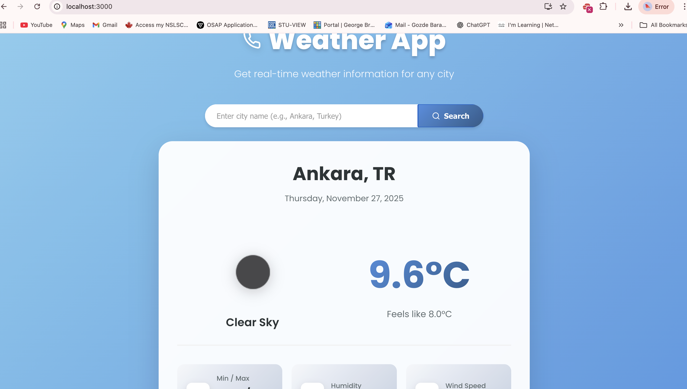
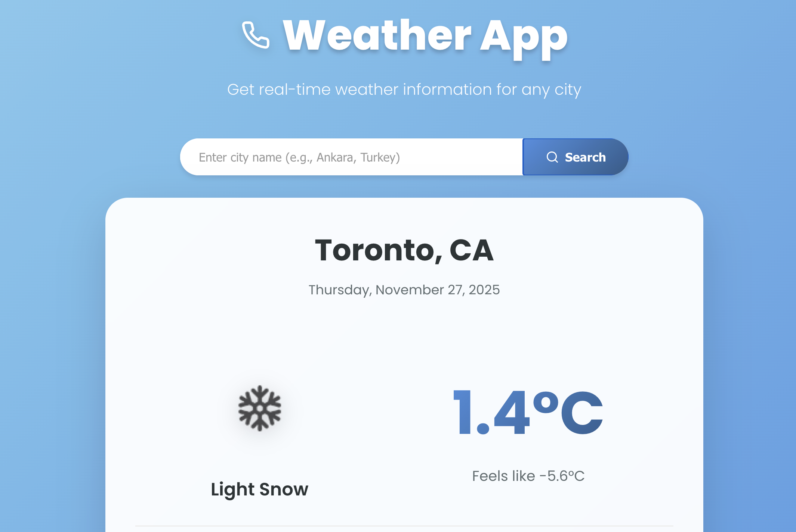
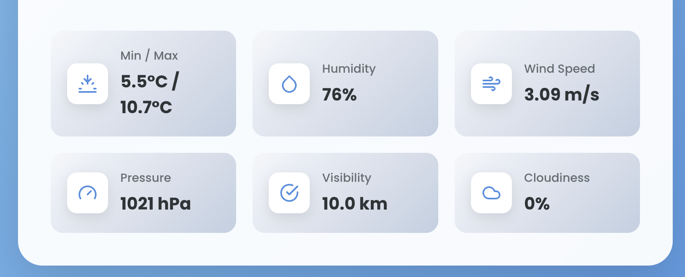
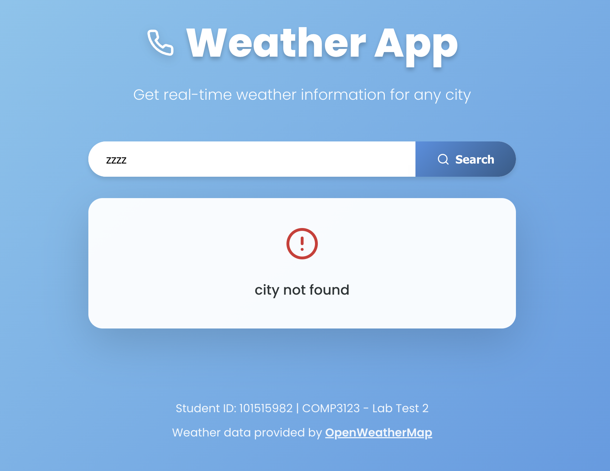
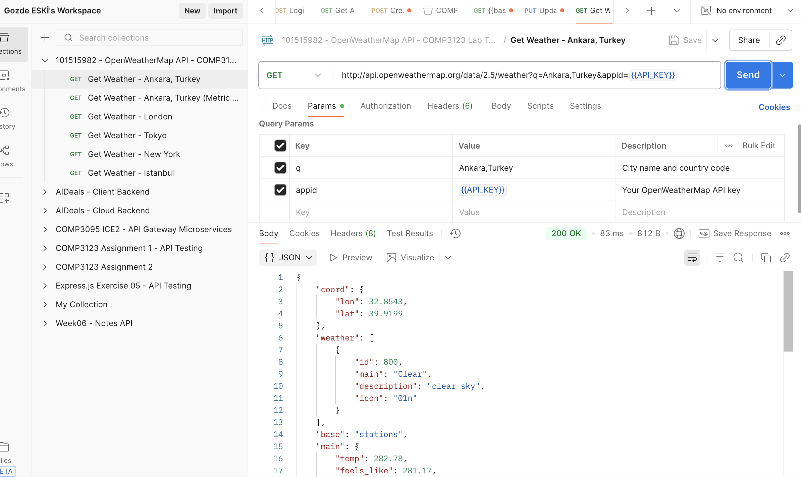
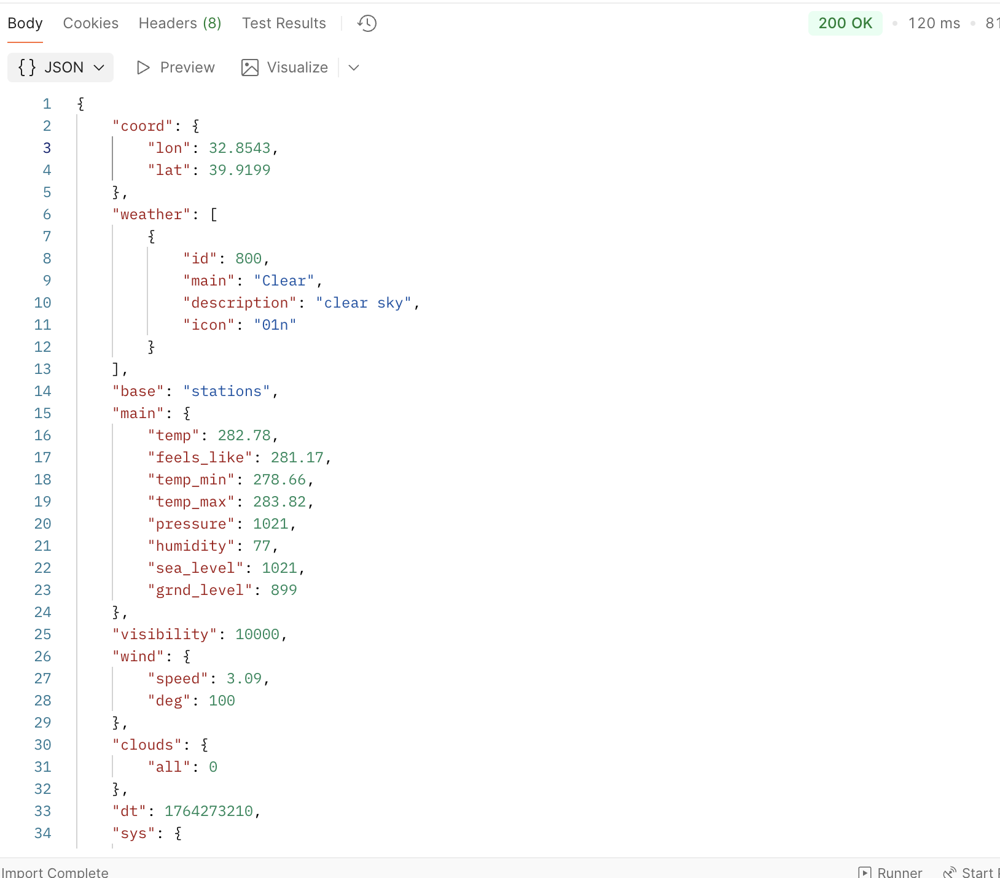

# 101515982_comp3123_labtest2 - Weather App

A modern, responsive React weather application that displays real-time weather information for any city using the OpenWeatherMap API.

## Student Information

- **Student ID**: 101515982
- **Course**: COMP3123 - Full Stack Development
- **Lab Test**: Lab Test 2

## Project Description

This Weather App allows users to search for and view current weather conditions for any city worldwide. The application features a clean, modern UI with gradient backgrounds, smooth animations, and comprehensive weather details including temperature, humidity, wind speed, pressure, visibility, and cloudiness.

## Features

- 🌍 Default location: Ankara, Turkey ( where I am from 😆)

## Technologies Used

- **React** (v18) - Frontend framework
- **Axios** - HTTP client for API requests
- **OpenWeatherMap API** - Weather data provider
- **CSS3** - Styling with gradients and animations
- **React Hooks** - useState, useEffect for state management

## API Used

**OpenWeatherMap API** - Current Weather Data

- API Endpoint: `https://api.openweathermap.org/data/2.5/weather`
- Documentation: https://openweathermap.org/current
- Weather Icons: https://openweathermap.org/weather-conditions

## Project Structure

```
101515982_comp3123_labtest2/
├── public/
├── src/
│   ├── components/
│   │   ├── SearchBar.js          # Search input component
│   │   ├── SearchBar.css         # Search bar styling
│   │   ├── WeatherCard.js        # Weather display component
│   │   └── WeatherCard.css       # Weather card styling
│   ├── App.js                    # Main application component
│   ├── App.css                   # Global app styling
│   └── index.js                  # React entry point
├── .env.example                  # Environment variable template
├── .gitignore                    # Git ignore file
├── package.json                  # Project dependencies
└── README.md                     # Project documentation
```

## API Integration Details

The app uses axios to make API calls to OpenWeatherMap:

```javascript
const response = await axios.get(API_URL, {
  params: {
    q: city,
    appid: API_KEY,
  },
});
```

## 🌐 Live Deployment

The application is deployed and accessible at:

**Live URL**: https://101515982-comp3123-labtest2.vercel.app/

**Hosting Platform**: Vercel

The app features:

- Automatic deployment from GitHub
- Environment variables configured securely
- Fast global CDN delivery
- Real-time weather data from OpenWeatherMap API

## Screenshots

### Main Interface - Ankara, Turkey



### Search Functionality



### Weather Details



### Mobile Responsive View


### Error Handling



## Postman API Testing

The following screenshots demonstrate API testing using Postman:

### Successful API Response - Ankara



### API Response Structure


